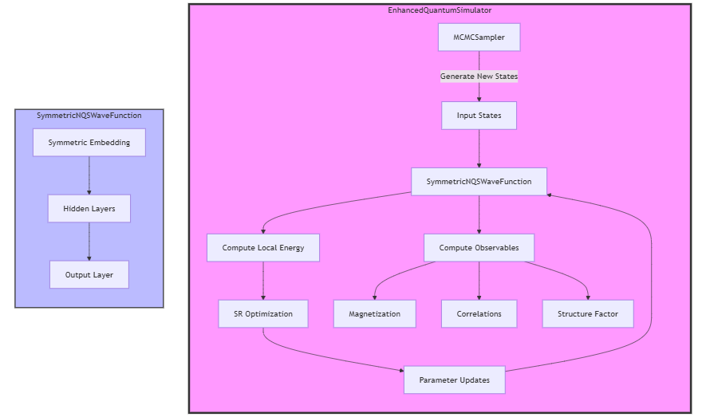

# NQS Quantum Many-Body Simulations

Try it out in Google Colab! Click the badge below to open the interactive notebook:

[](https://colab.research.google.com/drive/1PNCHddiiq2FroY2Zd5sI6LKNkLufcCA1?usp=sharing)


A PyTorch implementation of a Neural Quantum State (NQS) simulator for quantum many-body systems, featuring symmetry-preserving neural networks and advanced sampling techniques.


## Overview

This project implements a state-of-the-art quantum many-body simulator using Neural Quantum States (NQS). It combines deep learning techniques with quantum physics to simulate quantum systems efficiently. The implementation includes:

- Symmetry-preserving neural network architecture
- Parallel tempering MCMC sampling
- Stochastic Reconfiguration optimization
- Advanced numerical stability features
- Comprehensive physical observables calculation

## Features

- **SymmetricNQSWaveFunction**: Neural network that preserves quantum mechanical symmetries
- **MCMCSampler**: Advanced Markov Chain Monte Carlo sampling with parallel tempering
- **StochasticReconfiguration**: Stable optimization method for quantum systems
- **Physical Observables**: 
  - Energy and variance
  - Magnetization
  - Spin-spin correlations
  - Structure factor
- **Enhanced Visualization**: Comprehensive plotting of training metrics and physical quantities

## Requirements

```
torch>=1.9.0
numpy>=1.19.0
matplotlib>=3.3.0
```

## Usage

### Quick Start

```python
from quantum_simulator import run_enhanced_simulation

# Run simulation with default parameters
simulator, metrics = run_enhanced_simulation(
    n_sites=6,
    n_epochs=200,
    batch_size=500
)
```

### Advanced Usage

```python
from quantum_simulator import EnhancedQuantumSimulator

# Initialize simulator with custom parameters
simulator = EnhancedQuantumSimulator(
    n_sites=8,
    learning_rate=0.00002
)

# Configure Stochastic Reconfiguration
simulator.sr = StochasticReconfiguration(
    model=simulator.model,
    reg_factor=1e-3,
    min_svd=1e-6,
    batch_size=50
)

# Train and collect metrics
metrics = simulator.train_epoch(batch_size=1000)
```

## Results

The simulator achieves stable training and accurate physical results:

- Final Energy: -10.997144
- Final Variance: 0.000086
- Converged magnetization and correlation functions
- Stable learning dynamics throughout training

Example output metrics:
```
Starting enhanced simulation...
Number of sites: 6
Device: cuda
Epoch 0:
  Energy: -10.996608
  Variance: 0.000067
  Magnetization: -0.082667
  Nearest-neighbor correlation: 0.028000
  Learning rate: 2.00e-05
Epoch 10:
  Energy: -10.996914
  Variance: 0.000071
  Magnetization: -0.001333
  Nearest-neighbor correlation: 0.033600
  Learning rate: 2.00e-05
Epoch 20:
  Energy: -10.995793
  Variance: 0.000134
  Magnetization: -0.011333
  Nearest-neighbor correlation: 0.027200
  Learning rate: 2.00e-05
Epoch 30:
  Energy: -10.992054
  Variance: 0.000230
  Magnetization: 0.050667
  Nearest-neighbor correlation: 0.036000
  Learning rate: 2.00e-05
Epoch 40:
  Energy: -10.993916
  Variance: 0.000137
  Magnetization: -0.000000
  Nearest-neighbor correlation: 0.011200
  Learning rate: 2.00e-05
Epoch 50:
  Energy: -10.996450
  Variance: 0.000088
  Magnetization: -0.054667
  Nearest-neighbor correlation: 0.012000
  Learning rate: 2.00e-05
Epoch 60:
  Energy: -10.998333
  Variance: 0.000037
  Magnetization: -0.023333
  Nearest-neighbor correlation: 0.032000
  Learning rate: 2.00e-05
Epoch 70:
  Energy: -10.999022
  Variance: 0.000023
  Magnetization: -0.057333
  Nearest-neighbor correlation: 0.026400
  Learning rate: 2.00e-05
Epoch 80:
  Energy: -10.998788
  Variance: 0.000032
  Magnetization: -0.044000
  Nearest-neighbor correlation: 0.028000
  Learning rate: 2.00e-05
Epoch 90:
  Energy: -10.995109
  Variance: 0.000151
  Magnetization: -0.146000
  Nearest-neighbor correlation: 0.076000
  Learning rate: 2.00e-05
Epoch 100:
  Energy: -10.995549
  Variance: 0.000167
  Magnetization: -0.118000
  Nearest-neighbor correlation: 0.084800
  Learning rate: 1.00e-05
Epoch 110:
  Energy: -10.996321
  Variance: 0.000093
  Magnetization: -0.112667
  Nearest-neighbor correlation: 0.049600
  Learning rate: 1.00e-05
Epoch 120:
  Energy: -10.998017
  Variance: 0.000049
  Magnetization: -0.092000
  Nearest-neighbor correlation: 0.056000
  Learning rate: 1.00e-05
Epoch 130:
  Energy: -10.997794
  Variance: 0.000058
  Magnetization: -0.050667
  Nearest-neighbor correlation: 0.043200
  Learning rate: 1.00e-05
Epoch 140:
  Energy: -10.998185
  Variance: 0.000065
  Magnetization: -0.044667
  Nearest-neighbor correlation: 0.088000
  Learning rate: 1.00e-05
Epoch 150:
  Energy: -10.997000
  Variance: 0.000070
  Magnetization: -0.046000
  Nearest-neighbor correlation: -0.000800
  Learning rate: 1.00e-05
Epoch 160:
  Energy: -10.997014
  Variance: 0.000111
  Magnetization: -0.024000
  Nearest-neighbor correlation: 0.046400
  Learning rate: 1.00e-05
Epoch 170:
  Energy: -10.996198
  Variance: 0.000121
  Magnetization: -0.041333
  Nearest-neighbor correlation: 0.002400
  Learning rate: 5.00e-06
Epoch 180:
  Energy: -10.997696
  Variance: 0.000103
  Magnetization: -0.030000
  Nearest-neighbor correlation: 0.052800
  Learning rate: 2.50e-06
Epoch 190:
  Energy: -10.996375
  Variance: 0.000098
  Magnetization: -0.080000
  Nearest-neighbor correlation: 0.048000
  Learning rate: 2.50e-06

Simulation completed!
Final energy: -10.997144
Final variance: 0.000086
```

## Architecture

The project uses a modular architecture with the following key components:



## Documentation

Detailed documentation for each component:

### SymmetricNQSWaveFunction
- Implements symmetry-preserving neural network
- Uses residual connections and layer normalization
- Separates real and imaginary components

### MCMCSampler
- Implements parallel tempering
- Handles multiple Markov chains
- Includes proper metropolis updates

### StochasticReconfiguration
- Implements stable SR optimization
- Uses SVD with regularization
- Includes batched computation

## Citation

If you use this code in your research, please cite:

```bibtex
@software{nqs-quantum-simulator,
  author = {RaheesAhmed},
  title = {Neural Quantum State Simulator},
  year = {2024},
  publisher = {GitHub},
  url = {https://github.com/raheesahmed/nqs-quantum-simulator}
}
```

## Acknowledgments

- Thanks to the PyTorch team for their excellent deep learning framework
- Special thanks to the quantum physics community for theoretical foundations

## Contact

- RaheesAhmed - [raheesahmed256@gmail.com](mailto:raheesahmed256@gmail.com)
- Project Link: [https://github.com/raheesahmed/nqs-quantum-simulator](https://github.com/raheesahmed/nqs-quantum-simulator)
